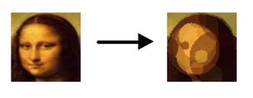
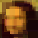

# Genetic algorithm

Program that tries to approximate picture (64x64 only) with various geometric shapes (circles or rectangles).  You can download most recent build [here](https://akela.mendelu.cz/~xhnatek/PP/bin.zip) (Windows only).

It uses genetic algorithm for finding optimal position, dimension and color of each shape.

Results of this process are demonstrated in picture below.

Another example could be this picture that was obtained with rectangle based approximation.

